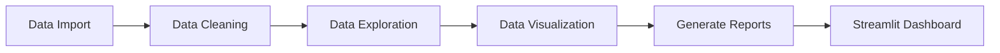

# 🎥 Netflix EDA

[](https://github.com/GeeksterLab/InteractiveNetflixEDA/actions)
[](https://codecov.io/gh/YourUsername/Netflix_EDA)
[](https://pypi.org/project/netflix-eda)
[](https://interactifnetflixeda.streamlit.app)

---

## 📖 Table of Contents

1.  [Introduction](#-introduction)  
2.  [Architecture](#-architecture)  
3.  [Project Structure](#-project-structure)  
4.  [Libraries](#-libraries)  
5.  [Installation](#-installation)  
6.  [Usage](#-usage)  
7.  [Streamlit Interface](#-streamlit-interface)  
8.  [Deployment](#-deployment)  
9.  [Reports](#-reports)  
10. [Tests & CI](#-tests--ci)  

---

## 🧐 Introduction

**Netflix EDA** is a Data Exploration (EDA) project focused on analyzing trends, genres, and performance of Netflix titles. The project explores historical and forecast data files, analyzes popular movies and TV shows, and generates detailed reports to visualize insights from the data.

---

## 🚧 Architecture

Here is a Mermaid diagram showing the main components and their interactions:



- **Data Import**: Loading raw data from CSV files.
- **Data Cleaning**: Preparing and cleaning the data.
- **Data Exploration**: Statistical exploration and identifying key trends.
- **Data Visualization**: Generating charts to better understand the data.
- **Generate Reports**: Generating detailed PDF and CSV reports.
- **Streamlit Dashboard**: Displaying the results on an interactive web interface.

---

## 📁 Project Structure

- **assets/**: Contains visual resources such as icons and CSS styles.
- **data/**: Folder containing raw (`raw`) and processed (`processed`) data files.
- **env/**: Virtual environment for managing project dependencies.
- **notebooks/**: Exploratory analysis with Jupyter.
- **reports/**: Reports generated during analysis, in PDF format.
- **scripts/**: Python scripts for analysis, report generation, etc.
- **visualization/**: Contains scripts and tools for visualization.
- **requirements.txt**: List of project dependencies.

---

## 📦 Libraries

* **pandas** → Data management and analysis.
* **matplotlib** → Data visualization.
* **seaborn** → Advanced data visualization.
* **numpy** → Numerical computation.
* **scikit-learn** → Statistical models and machine learning.
* **streamlit** → Interactive web interface to visualize data and EDA results.
* **pytest** → Unit and integration testing.
* **fpdf** → PDF report creation.

---

## ⚙️ Installation

1. Clone the repository:
```bash
git clone https://github.com/YourUsername/Netflix_EDA.git
cd Netflix_EDA
```

2. Create and activate a Python environment:
```bash
python3.11 -m venv env
source env/bin/activate
```

3. Install dependencies:
```bash
pip install -r requirements.txt
```

4. Install the project in development mode:
```bash
pip install -e .
```

---

## 🚀 Usage

1. Run the Streamlit interface to explore the data interactively:
```bash
streamlit run scripts/streamlit_app.py
```

---

## 🌐 Streamlit Interface

The project includes a **Streamlit** interface that allows you to visualize the EDA interactively. You can easily explore trends of Netflix movies and TV shows, view charts on popular genres, ratings, and much more.

To start the **Streamlit** interface, simply run:
```bash
streamlit run scripts/streamlit_app.py
```

The web interface will launch, and you can interact with your data via a visual dashboard.

---

## ☁️  Deployment

- You can try this project on Streamlit instead of installing it locally.

[](https://smartfocusai.streamlit.app)


---

## 📑 Reports

Analysis results are generated as PDF reports in the **reports/** folder, containing visualizations and statistical summaries.

Example of a generated report:
```bash
./reports/Netflix_Analysis_Report_20250406.pdf
```

---

## 🧪 Tests & CI

To run unit and integration tests:
```bash
pytest --cov=netflix_eda --cov-report=term-missing --cov-report=xml
```

---

MIT © 2025 [YourUsername]
